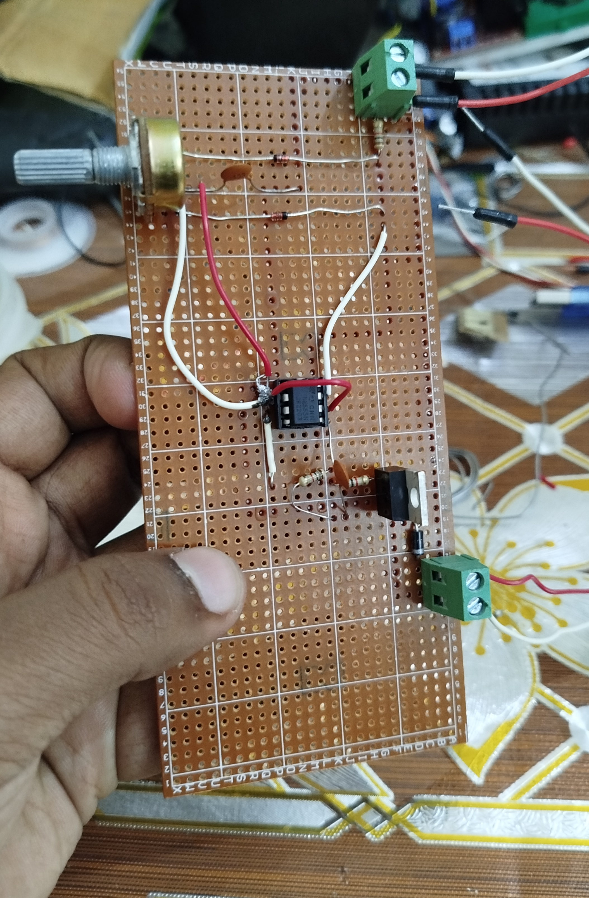
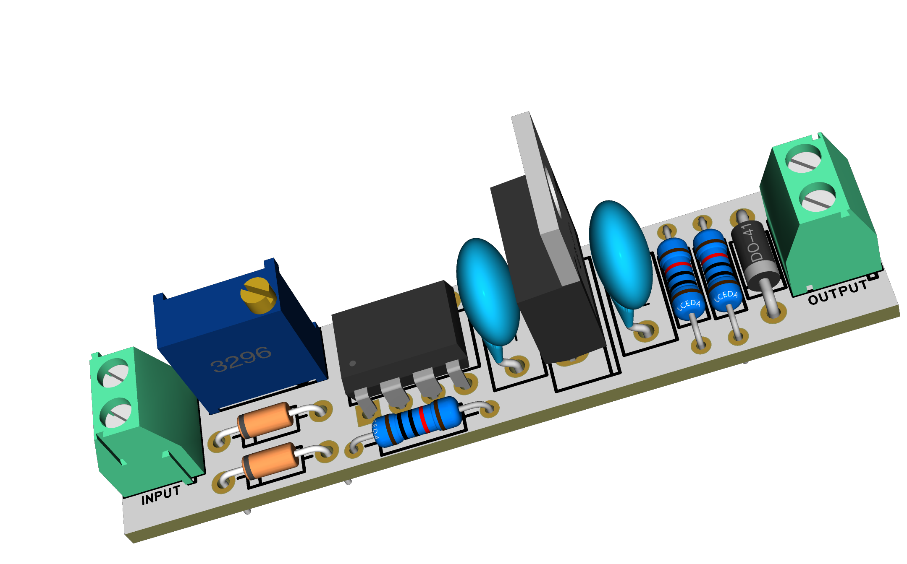

# Motor Speed Controller using 555 Timer

A simple DC motor speed controller built using the classic 555 Timer IC.

---

## 🔧 The Circuit
Here’s the soldered circuit I made on a **veroboard**:  

  

---

## 🖥️ PCB Design
Later, I designed a PCB using **EasyEDA Pro**.  
Here’s the 3D view of the PCB:  

---

## ▶️ Demo Video
Watch the project in action on my YouTube channel:  
👉 [YouTube Demo](https://youtube.com/shorts/4StVPE67ADM)

---

## ⚡ How It Works
The circuit works using **PWM (Pulse Width Modulation)** generated by the **555 Timer IC** in astable mode.  

- The duty cycle of the PWM is adjusted with a potentiometer.  
- This changes the average voltage applied to the DC motor.  
- A MOSFET is used as a switch for efficient motor control.  

---

## 🛠️ Parts List
- 10nF Ceramic Capacitor  
- 0.1µF Ceramic Capacitor  
- 1N4148B Diode  
- 1N4001 Diode  
- LM555CN Integrated Circuit  
- IRFZ44NPBF MOSFET  
- 1kΩ Resistor
- 100kΩ Potentiometer  
  

---

✨ A classic example of how a small IC like the **555 Timer** can be used to control motor speed.
